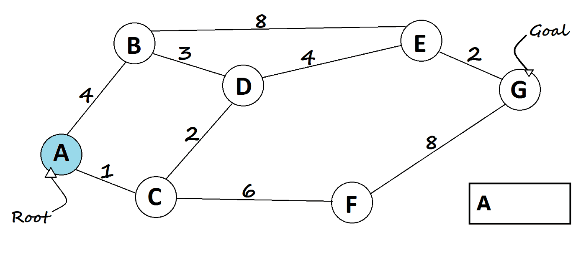

# CS225_Final_Project_OpenFlights

## About
This is a project for UIUC CS225 Data Structures class. 
The project uses the Open Flights data set to run several graph algorithms on it to find out things like the BFS, cycles, and shortest path between airports.

## Goals

The main goal of the project is to devlop code to answer the questions what is the shortest path between two airports, detect cycles in airports, find he distance between airports, and to preform a BFS on airports.

## Group Members
Dhruva Dammanna (dhruvad2)\
Alan Zhang (alanyz2)\
Jalen Xing (jalenx2)\
David Lin (davidl16)

## How to run our program
In the CS225 default docker container paste the following line into terminal:  
https://github.com/DhruvaD1/CS225_Final_Project_OpenFlights.git

Once you are in the CS225_Final_Project_OpenFlights folder, follow the following steps:  
mkdir build  
cd build  
cmake ..  

To compile and run our test cases stay in the build folder and enter the following commands in order to compile and execute respectively:  
make test  
./test  

To run our main.cpp stay in the build folder and run the following commands in order to compile and execute respectively:  
g++ -o main .././src/main.cpp  
./main  

Input data can be changed in the input.txt file, which is in the CS225_Final_Project_OpenFlights folder, and all data will be output to output.txt also located in CS225_Final_Project_OpenFlights. To input data into input.txt, type in the 3 digit airport code with all capital letters into the specified lines in input.txt. Instructions and information for inputting data are also written in input.txt.

ATTENTION: Running main can take up to several minutes.

## The Data (https://openflights.org/data.html)

There were two datasetst both from the Open Flights Data Set. One that had airports that flew to eachother and one that had information about individual airports like
the location of it

The data was processed by using functions from mp_scheduele file_to_string and splitString. We also created two functions to parse the data from the two datasets 
parseData and parseRoutes. Both of these fucntions used the two functions from mp_scheduele. 

Lastly in the data there were some places like helicopter landing sites that airplanes can not land in so those had to be removed from the data.

## BFS

The BFS created ran BFS search from a chosen starting point and returned a vector of every airport in order visted. Also the function printed out how many kilometers apart the two airports at the start and the end were. BFS runs in O(m+n) runtime and O(V) space.

## Dijkstra 

Dijkstra algorithm was made and used to find the shortest path in a weighted graph. It is especiall useful in this because it will give the fastest route from one airport to another. It runs in O(V log V) runtime and O(V) space.

## Eulers

Eulers cycle detection is a way to determine if there is a cycle at a given point of a graph. We can use it here to detect if you can forms a cycle out of airports.
The run time is O(V+E) and space is O(V).

## Findings

With the BFS we found the BFS Traversal from a starting point and the distance traveled. We noticed that pretty much every airport in the world is connected in some way. So you can go from pretty much any aiport to another aiport.

With the Euler Cycle we saw that there are a lot of cycles between airports. So being able to going in a full cycle from any airport is possible from most airports.

With the Dijkstra algorithm we noticed that the shortest path from an aiport normally involved passing through a popular airport like ORD, DFW, and LAX because they have flights to many different airports.

