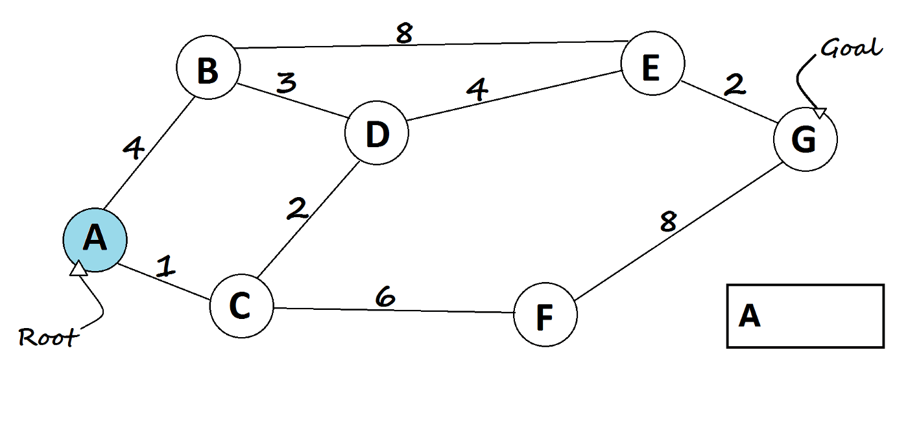

# CS225_Final_Project_OpenFlights

## Results

## BFS

Our Breadth First Search Algorithm searches all the airports you can travel to based on the airport you start off with. The method was successful due to running extensive tests on the BFS algorithm to make sure it would work by looking up different airports in the routes.txt file and confirming the airports it could be able to fly to.

## Dijkstra 

Dijkstra algorithm was made and used to find the shortest path in a weighted graph. The algorithm was initially tested with a smaller dataset that was hand drawn. After showing it worked for those cases, we moved onto testing various airports on the entire data set. The algorithm would accept two parameters, a starting airport and ending airport, and would return the shortest path from the two airports using the routes.txt and data.txt files. 

## Eulers

We implemented Euler's path so that only one edge will be traversed exactly once. The function would take in a starting airport and would see if there was an Euler path or not. If there was an Euler path, the path would be printed. The method would be deemed successful because we tested the Euler path on various airports and we would count to see if the size of the path minus one would be equal to the number of nodes for a given airport in the adjacency list.

